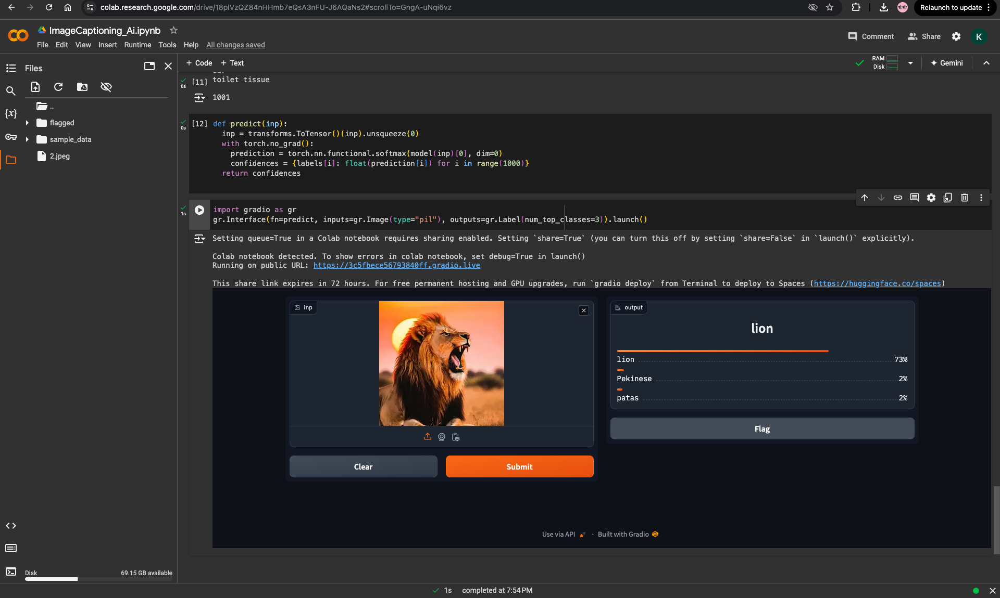
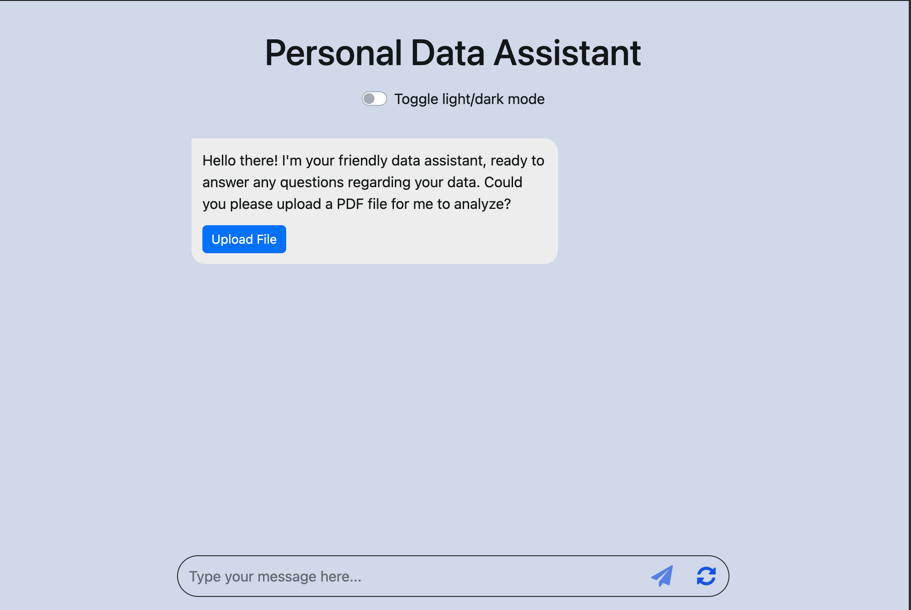

# GEN AI-Applications-HuggingFace

## Generative AI Project

This repository documents my journey through building various generative AI applications, starting from image captioning with BLIP to building a sophisticated chatbot using LLaMA-7B with LangChain and RAG (Retrieval-Augmented Generation). This README file will guide you through understanding the key elements of the project, how to run it, and what you can expect from it.

## Table of Contents

Project Overview

Features

Tech Stack

Installation

Usage

Future Improvements

License

## Project Overview

This project comprises different stages of generative AI model development:

Image Captioning with BLIP: Bootstrapped Language Image Pre-training (BLIP) was used to generate context-rich image captions, providing a robust foundation for understanding image-language interactions.

Chatbot with OpenAI API: A chatbot was created using OpenAI models to gain insights into conversational AI. It helped me understand the intricacies of large language models in generating human-like responses.

Advanced Chatbot Using LLaMA-7B-Instruct and LangChain: Leveraged LLaMA-7B-Instruct with LangChain and implemented Retrieval Augmented Generation (RAG) to build a more advanced, information-aware chatbot.

User Interface for Interaction: Built a simple yet effective UI using HTML/CSS/JavaScript to facilitate user interactions with the chatbot, with a backend hosted on Flask.

## Features

Image Captioning: Generate rich captions for images using the BLIP model.

Conversational Chatbot: Chatbot powered by LLaMA-7B and OpenAI for real-time conversational capabilities.

Information Retrieval with RAG: Enhanced chatbot responses with relevant and targeted data retrieval.

User-Friendly Interface: A clean web-based UI for easy interaction with the chatbot.

## Tech Stack

Python: Model integration and backend services.

BLIP: For advanced image captioning.

OpenAI API: Utilized for the initial chatbot development.

LLaMA-7B-Instruct & LangChain: For building a highly interactive chatbot.

Retrieval Augmented Generation (RAG): Boosted the information retrieval capabilities.

Flask: For hosting the API.

HTML/CSS/JavaScript: For building a web interface.

## Installation

To set up and run this project locally:

## Clone the repository:

Install the necessary dependencies:
Run the Flask server:
test with your prompts

Contributions

Contributions are welcome! If you have any ideas, improvements, or bug fixes, feel free to fork the repository and create a pull request. Let’s make generative AI accessible and powerful together!

Contact
# keshavc192@gmail.com

For any questions or feedback, feel free to reach out or open an issue in the repository.

